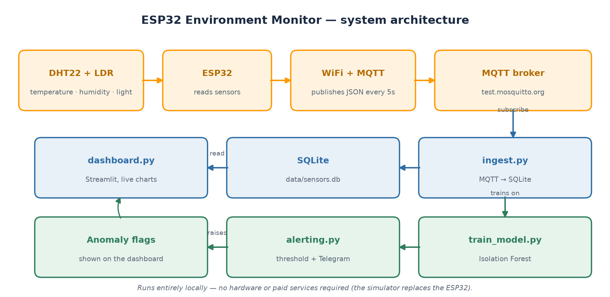
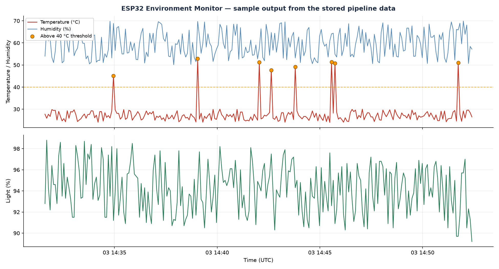

# 🌡️ ESP32 Environment Monitor with ML Anomaly Detection

An end-to-end IoT project: an ESP32 with a DHT22 sensor and an LDR streams live temperature, humidity and light readings over MQTT, a Python service stores them, a Streamlit dashboard visualises them in real time, an Isolation Forest model flags unusual patterns, and an alerting service raises alerts when readings cross a threshold.



## 🎯 The Problem It Solves

Monitoring a room, lab, or equipment rack usually means either checking a display by hand or buying a closed commercial system you cannot extend. This project builds the whole path yourself — sensor to dashboard to alert — so the data is yours and every layer can be changed. The anomaly detection matters because a slow drift or a sudden spike is easy to miss on a chart but obvious to a model watching the pattern.

```
[DHT22 + LDR] → [ESP32] → WiFi → [MQTT broker] → [ingest.py] → [SQLite] → [dashboard.py]
                                                        ↓
                                          [train_model.py] — anomaly scores
                                          [alerting.py]    — threshold alerts
```

## ✨ Features

- 📡 **Real IoT pipeline** — sensor → firmware → MQTT → database → dashboard
- 🔌 **MQTT messaging** — the industry-standard IoT protocol
- 🌡️ **Three readings** — temperature, humidity and light level
- 📊 **Live dashboard** — auto-refreshing charts, °C/°F toggle, adjustable anomaly sensitivity
- 🤖 **ML anomaly detection** — Isolation Forest scores every reading
- 🔔 **Alerting** — raises alerts above a temperature threshold, with optional Telegram notifications
- 🧪 **Works without hardware** — a simulator publishes the same messages as the real ESP32
- ✅ **Tested** — 19 unit tests, run automatically on every push

## 📈 Sample output

Readings produced by the simulator and plotted from the stored data, with the 40 °C alert threshold marked:



## 📁 Project structure

```
esp32-environment-monitor/
├── firmware/
│   ├── esp32_environment_monitor.ino   # ESP32 sketch (WiFi + DHT22 + LDR + MQTT)
│   └── README.md                       # wiring, libraries, parts list
├── simulator/
│   └── sensor_simulator.py            # fake ESP32 for testing without hardware
├── backend/
│   ├── ingest.py                      # MQTT subscriber → SQLite
│   ├── alerting.py                    # threshold alerts + Telegram notifications
│   └── dashboard.py                   # Streamlit live dashboard
├── ml/
│   └── train_model.py                 # trains the Isolation Forest detector
├── tests/
│   └── test_pipeline.py               # unit tests (no hardware or network needed)
├── docs/
│   ├── architecture.png               # system diagram
│   ├── sample-output.png              # example readings
│   └── aws-migration.md               # plan for moving this onto AWS
├── .github/workflows/tests.yml        # runs the tests on every push
├── data/                              # (generated) SQLite DB + trained model
├── ROADMAP.md                         # planned work, in build order
├── CONTRIBUTING.md
├── LICENSE
└── requirements.txt
```

## 🚀 Quick start (no hardware needed)

1. **Install dependencies**

   ```bash
   pip install -r requirements.txt
   ```

2. **Start the ingest service** (terminal 1) — receives and stores readings

   ```bash
   python backend/ingest.py
   ```

3. **Start the sensor simulator** (terminal 2) — publishes readings like a real ESP32

   ```bash
   python simulator/sensor_simulator.py
   ```

4. **Train the anomaly detector** (terminal 3) — once you have some readings

   ```bash
   python ml/train_model.py
   ```

5. **Start the alerting service** (terminal 4) — optional, raises alerts on high temperature

   ```bash
   python backend/alerting.py
   ```

6. **Launch the dashboard** (terminal 5)

   ```bash
   streamlit run backend/dashboard.py
   ```

   Open `http://localhost:8501`. The simulator injects occasional temperature spikes — watch the ML model flag them and the alerting service raise alerts.

## ⚙️ Configuration

Everything runs with sensible defaults. Override any of these with environment variables:

| Variable | Default | Used by |
|---|---|---|
| `PUBLISH_INTERVAL_SECONDS` | `5` | simulator — seconds between readings |
| `ANOMALY_CHANCE` | `0.05` | simulator — fraction of readings that are spikes |
| `MQTT_BROKER` / `MQTT_PORT` | `test.mosquitto.org` / `1883` | simulator, ingest |
| `ANOMALY_CONTAMINATION` | `0.1` | training — expected fraction of anomalies |
| `ALERT_TEMP_THRESHOLD` | `40` | alerting — °C above which an alert fires |
| `POLL_SECONDS` | `10` | alerting — how often to check |
| `TELEGRAM_BOT_TOKEN` / `TELEGRAM_CHAT_ID` | *(unset)* | alerting — optional notifications |

Example:

```bash
PUBLISH_INTERVAL_SECONDS=30 python simulator/sensor_simulator.py
```

## 🔔 Alerts

`backend/alerting.py` watches for readings above `ALERT_TEMP_THRESHOLD`, records each one in an `alerts` table (which the dashboard displays), and notifies you.

With no configuration it prints alerts to the console. To get them on your phone, create a Telegram bot with [@BotFather](https://t.me/BotFather), then:

```bash
export TELEGRAM_BOT_TOKEN="your-bot-token"
export TELEGRAM_CHAT_ID="your-chat-id"
python backend/alerting.py
```

**Never commit tokens.** Set them in your environment, as above.

## 🧪 Tests

The pipeline logic — the database layer and its migration, MQTT message handling, the simulator's output and configuration, the ML detector, the dashboard's anomaly logic, and the alerting service — is covered by unit tests that need no hardware and no network:

```bash
pytest -q
```

They run automatically on every push via GitHub Actions.

## 🔩 Running on real hardware

See [`firmware/README.md`](firmware/README.md) for wiring, libraries and setup. Once flashed, the ESP32 publishes to the same MQTT topic, so the rest of the pipeline works unchanged.

**Parts list (~₹650–1,000):**

| Component | Approx. price |
|---|---|
| ESP32 DevKit V1 | ₹300–500 |
| DHT22 temperature/humidity sensor module | ₹200–350 |
| LDR (photoresistor) + 10 kΩ resistor | ₹20–40 |
| Breadboard + jumper wires | ₹100–150 |

## 🛠️ Technologies used

- **Firmware:** C++ (Arduino), PubSubClient, Adafruit DHT, ArduinoJson
- **Backend:** Python, paho-mqtt, SQLite, urllib
- **Dashboard:** Python, Streamlit, pandas
- **ML:** scikit-learn (Isolation Forest), numpy, joblib
- **Testing:** pytest, GitHub Actions

## 🗺️ Roadmap

See [ROADMAP.md](ROADMAP.md). Levels 1–3 and 6 are complete; Level 4 needs physical hardware and Level 5 needs an AWS account. The AWS plan is written up in [docs/aws-migration.md](docs/aws-migration.md).

## 🤝 Contributing

See [CONTRIBUTING.md](CONTRIBUTING.md) — contributions are welcome.

## 📄 License

Released under the [MIT License](LICENSE).

## ✍️ Author

**Ganamolla Shiva Prasad** — B.Tech ECE student, building in Python, AI/ML, and embedded systems.
